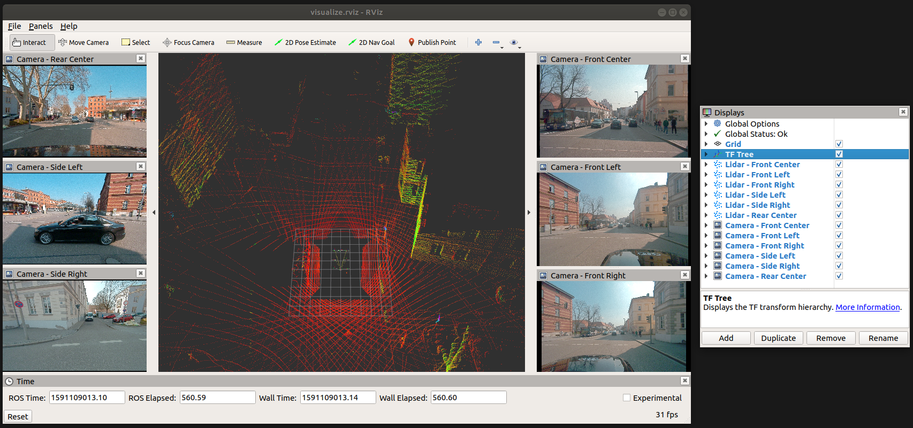

# A2D2 to ROS



Utilities for converting [A2D2 data sets](https://www.a2d2.audi/) to ROS bags.

There is an executuable for each sensor modality: camera, lidar, and bus. Bag files are generated for these modalities independently.

## Step-by-step example

For a step-by-step example of how to use the converters, see [docs/WALKTHROUGH.md](docs/WALKTHROUGH.md).

## Requirements

This package has the following dependencies in addition to standard ROS dependencies:

* [RapidJSON](https://rapidjson.org/): used to load, parse, and validate the JSON data files
* [ROS CNPY](https://gitlab.com/MaplessAI/external/ros_cnpy): used to load `.npz` files for lidar data

The ROS CNPY package can be downloaded at the above link, and RapidJSON can be installed with:

```console
$ rosdep install a2d2_to_ros --ignore-src -r -y
```

## Recommendations

* Use a dedicated download utility, such as `wget`, for downloading the data set files. Using a browser can be unreliable, likely due in part to the large size of the files.
* Use the `--start-time`, `--min-time-offset`, and `--duration` converter options to split the converted bag files into smaller timespans (see [scripts/convert.sh](scripts/convert.sh) for an example of doing this). The `rosbag` utility does a [poor job](https://github.com/ros/ros_comm/issues/117) handling extremely large log files, so splitting them up can make them easier to use.

## FAQ

[docs/FAQ.md](docs/FAQ.md) contains common questions about the A2D2 data set.

## Converters

* [Sensor Fusion > Camera](docs/CAMERA_CONVERTER.md)
* [Sensor Fusion > Lidar](docs/LIDAR_CONVERTER.md)
* [Sensor Fusion > Bus Signal](docs/BUS_SIGNAL_CONVERTER.md)

> Note: The Bus Signal converter also creates a bag file that publishes the TF tree for the vehicle.

## Batch conversion

For convenience, a shell script is provided in [scripts/convert.sh](scripts/convert.sh) that can batich convert an entire sensor fusion data set for a single city. Before running the script, be sure to open it and set the configuration options appropriately.

```bash
#
# START: CONFIGURATION OPTIONS
#

# The below two paths should point to the data set root and ROS package
package_source=~/catkin_ws/src/a2d2_to_ros
data_root=~/data/a2d2

# Duration (in integer seconds) to record to a single bag file before splitting off a new one
split_duration=7

# Relative location of the sensor fusion data set being converted
# Set 'sensor_data' to the desired location
munich_data= #TODO
gaimersheim_data= #TODO
ingolstadt_data=camera_lidar/20190401_145936
sensor_data=$ingolstadt_data

# Earliest time in the data set (in microseconds) for which all sensor modalities provide data
# Set 'record_start_time' to the appropriate time for the dataset being converted
munich_start_time= #TODO
gaimersheim_start_time= #TODO
ingolstadt_start_time=1554121593489120
record_start_time=$ingolstadt_start_time

# Approximate duration (in integer seconds) of the data set
# Set 'data_set_duration' to the appropriate duration
munich_duration= #TODO
gaimersheim_duration= #TODO
ingolstadt_duration=746
data_set_duration=$ingolstadt_duration

#
# END: CONFIGURATION OPTIONS
#
```

To run the script:

```console
$ rosrun a2d2_to_ros convert.sh
```

> Note: Be aware that the batch converter skips a bit of time at the beginning of certain sensor logs in order to enusre that split bag files are better time aligned; not all logs begin at the same time. See [docs/FAQ.md](docs/FAQ.md).

> Note: Do not run this script on the preview data set. The preview data set uses a slightly different file layout, so it will not work.

## Visualization

An example RViz config is included along a convenience launch file:

```console
$ roslaunch a2d2_to_ros visualize.launch
```

This launches RViz pre-configured to visualize the TF tree, and the front-facing camera and lidar data.

## Compatibility

This code is built and tested under:

* [ROS Melodic](https://wiki.ros.org/melodic) with [Ubuntu 18.04.4](http://releases.ubuntu.com/18.04/)
* [Clang 6.0.0](https://releases.llvm.org/6.0.0/tools/clang/docs/ReleaseNotes.html) with `-std=c++14`

There is nothing very platform specific, so other reasonably similar system configurations should work.

## TODO

A list of open issues for the converter can be found [here](https://gitlab.com/MaplessAI/external/a2d2_to_ros/-/issues).

## Contact

For any questions or comments about the converter, please reach out to <jeff@mapless.ai>.
