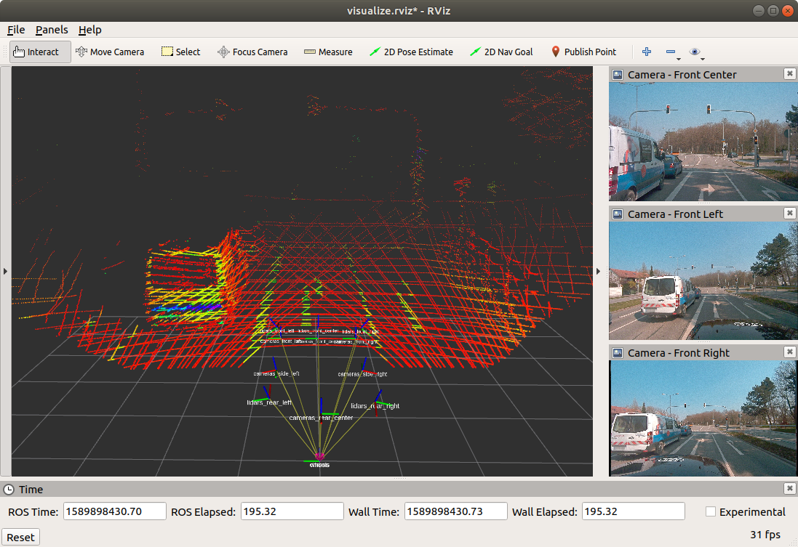

# A2D2 to ROS



Utilities for converting [A2D2 data sets](https://www.a2d2.audi/) to ROS bags.

There is an executuable for each sensor modality: camera, lidar, and bus. Bag files are generated for these modalities independently.

## Step-by-step example

For a step-by-step example of how to use the converters, see [docs/WALKTHROUGH.md](docs/WALKTHROUGH.md).

## Requirements

This package has the following dependencies in addition to standard ROS dependencies:

* [RapidJSON](https://rapidjson.org/): used to load, parse, and validate the JSON data files
* [ROS CNPY](https://gitlab.com/MaplessAI/external/ros_cnpy): used to load `.npz` files for lidar data

The ROS CNPY package can be downloaded at the above link, and RapidJSON can be installed with:

```console
$ rosdep install a2d2_to_ros --ignore-src -r -y
```

## FAQ

[docs/FAQ.md](docs/FAQ.md) contains common questions about the A2D2 data set.

## Converters

* [Sensor Fusion > Camera](docs/CAMERA_CONVERTER.md)
* [Sensor Fusion > Lidar](docs/LIDAR_CONVERTER.md)
* [Sensor Fusion > Bus Signal](docs/BUS_SIGNAL_CONVERTER.md)

> Note: The Bus Signal converter also creates a bag file that publishes the TF tree for the vehicle.

## Batch conversion

For convenience, a shell script is provided that can batch convert the whole data set. Before running the script, be sure to open it and set the configuration options appropriately:

```bash
#
# START: CONFIGURATION OPTIONS
#

# The below two paths should point to the data set root and ROS package
package_source=~/catkin_ws/src/a2d2_to_ros
data_root=~/data/a2d2-preview

# This should point to the particular sensor fusion data set being converted
sensor_data=camera_lidar/20180810_150607

bus_data_subdir_full=/bus
bus_data_subdir_preview=
# Set this depending on which data you're converting (preview or full)
bus_data_subdir=$bus_data_subdir_preview

#
# END: CONFIGURATION OPTIONS
#
```

To run the script:

```console
$ rosrun a2d2_to_ros convert.sh
```

## Visualization

An example RViz config is included along a convenience launch file:

```console
$ roslaunch a2d2_to_ros visualize.launch
```

This launches RViz pre-configured to visualize the TF tree, and the front-facing camera and lidar data.

## Compatibility

This code is built and tested under:

* [ROS Melodic](https://wiki.ros.org/melodic) with [Ubuntu 18.04.4](http://releases.ubuntu.com/18.04/)
* [Clang 6.0.0](https://releases.llvm.org/6.0.0/tools/clang/docs/ReleaseNotes.html) with `-std=c++14`

There is nothing very platform specific, so other reasonably similar system configurations should work.

## TODO

A list of open issues for the converter can be found [here](https://gitlab.com/MaplessAI/external/a2d2_to_ros/-/issues).

## Contact

For any questions or comments about the converter, please reach out to <jeff@mapless.ai>.
